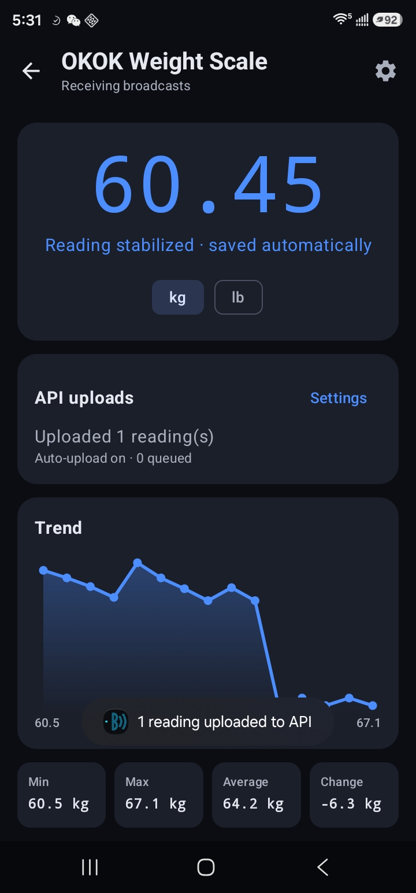
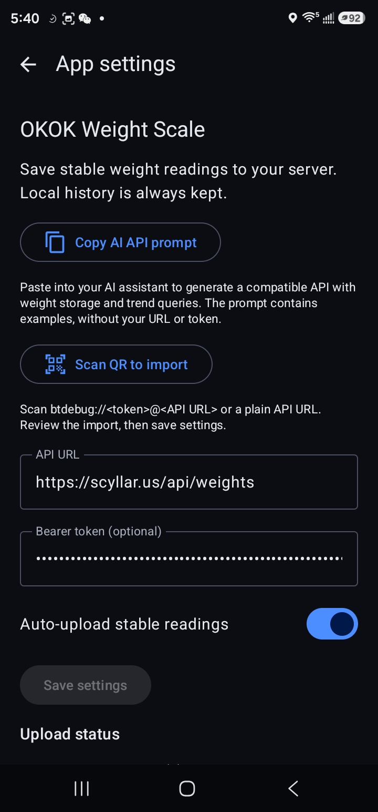
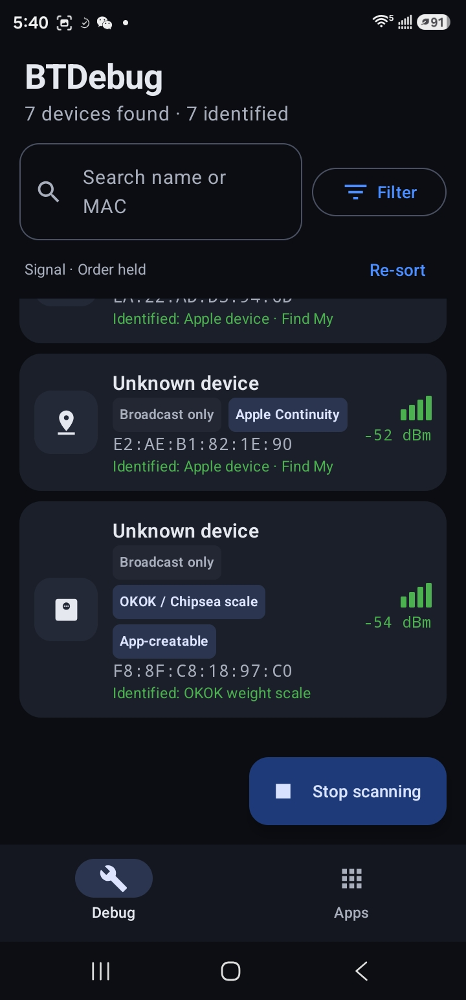
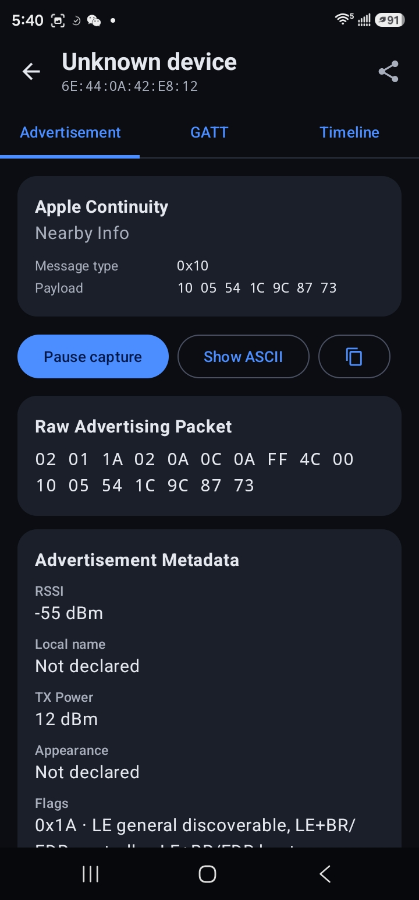
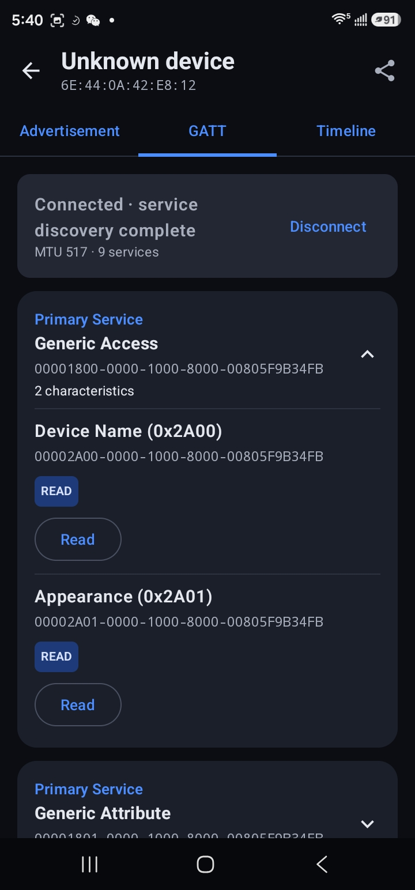
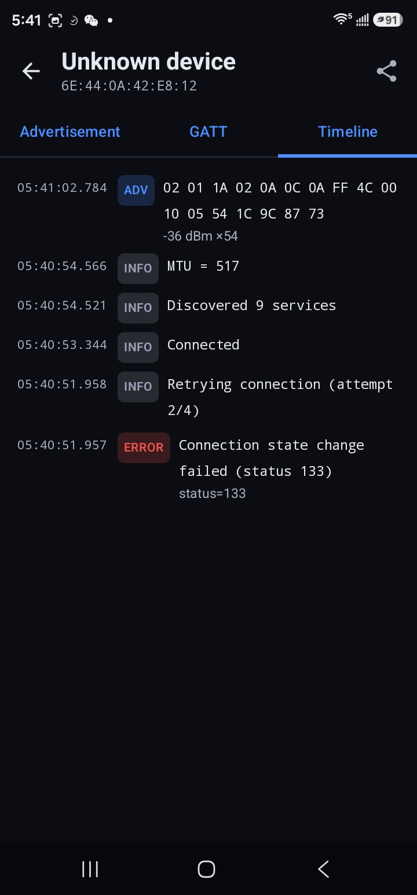

# BTDebug

An Android Bluetooth Low Energy debugging app built with Kotlin and Jetpack
Compose. Inspect nearby BLE devices, explore GATT services, and turn supported
weight scale broadcasts into a dashboard with local history and optional uploads
to your own server.

## Download

Get the release version on [Google Play](https://play.google.com/store/apps/details?id=com.btdebug.btdebugger).

## Screenshots

Version `26100602` (`2026.10.6`).

| Weight dashboard and upload confirmation | App settings and QR import | BLE device scanner |
| --- | --- | --- |
|  |  |  |

| Advertisement inspection | GATT services | Event timeline |
| --- | --- | --- |
|  |  |  |

## Features

- Live device discovery with RSSI, device identification, search, filters, and
  saved filter presets.
- Stable device ordering: live values update without moving existing rows, and
  new devices appear at the bottom. Tap **Re-sort** or change the sort mode to
  reorder by signal, name, or recent activity.
- Pin devices with the pin button to keep them above unpinned devices. Pins are
  saved across app restarts and still respect search and filters. Unpinning
  restores a device to its position in the held order.
- Advertisement inspection and decoding, including OKOK/Chipsea scales,
  iBeacon, Eddystone, and Apple Continuity.
- GATT service discovery, characteristic reads and writes, and notification
  subscriptions for connectable devices.
- JSON and CSV exports from the device detail screen.
- Weight dashboards with kg/lb display, local history, trend charts, and summary
  statistics. Stable readings are saved automatically.
- Per-app API settings, automatic uploads, historical uploads, persistent retry
  queues, upload status, and success toasts.
- QR import of API URLs and tokens, plus a copyable AI prompt for generating a
  compatible server API.

## Requirements

- Android 8.0 (API 26) or later with Bluetooth LE support.
- JDK 17 or later, Android SDK platform 36, and Android SDK platform-tools
  (`adb`) for development.
- `make`, Bash, and Python 3 for the Makefile workflows.
- Google Play services for QR scanning. The scanner module may need to download
  on first use.

Set the SDK location using Android Studio or a local `local.properties` file:

```properties
sdk.dir=/absolute/path/to/Android/sdk
```

The project includes the Gradle wrapper; a separate Gradle installation is not
required. Grant the requested Bluetooth and location permissions in the app.

## Development

Enable **Wireless debugging** on your Android device and pair it with this
computer first. With the device reachable on the local network, run:

```bash
make dev-android
```

This discovers authorized wireless devices through ADB mDNS, builds the debug
APK, installs it, and launches the app. When several devices are available,
select a hardware serial or advertised endpoint:

```bash
POMATEZ_ANDROID_SERIAL=<hardware-serial> make dev-android
```

The selector retains its original `POMATEZ_ANDROID_SERIAL` name. Debug builds
use `com.btdebug.btdebugger.dev`; release builds use `com.btdebug.btdebugger`,
so both can be installed together.

To build without installing, or run the existing unit tests:

```bash
./gradlew :app:assembleDebug
./gradlew :app:testDebugUnitTest
```

## Weight scale app

1. In **Debug**, open a supported scale with the **App-creatable** tag.
2. Tap **Create app**, enter a name, then open the dashboard from **Apps**.
3. Keep the weight app open while taking a measurement. Three identical decoded
   weights in a row are treated as stable, with duplicate suppression between
   nearby readings.
4. Use the top-right gear or the **API uploads → Settings** button to open
   **App settings**.

Weight decoding currently supports OKOK/Chipsea advertisement payloads; other
scales are not guaranteed to work. BLE scanning stops when the app is
backgrounded.

## Upload readings to your server

In **App settings**, enter the full POST URL, optionally enter a Bearer token,
enable **Auto-upload stable readings**, and tap **Save settings**. Automatic
uploads are off by default, and settings are separate for each weight app.

Each reading is saved locally before uploading. The weight dashboard shows
upload status and the queued count; a toast reports successful uploads. Failed
requests remain queued after restarting the app. Use **Retry queued uploads**
or **Upload unsent history** to send records manually.

The server receives one JSON POST per reading, with `event_id`, `app_id`,
`app_name`, `weight_kg`, `measured_at`, and `device_address`. It must persist and
deduplicate events before returning HTTP 2xx. Weight is always sent in kilograms.
See the [API integration guide](docs/weight-api.md) for the complete request
contract and retry behavior.

Tap **Copy AI API prompt** to copy backend requirements, including persistent
storage, authentication, trend queries, deduplication, and QR setup. The prompt
uses examples and does not contain your configured URL or token.

### Import settings with a QR code

Tap **Scan QR to import** and scan a QR containing:

```text
btdebug://YOUR_TOKEN@https://your-server.com/api/weights
```

Percent-encode special characters in the token, such as `@` → `%40`, and keep
the complete API URL unchanged. Without a token, use:

```text
btdebug://@https://your-server.com/api/weights
```

Plain HTTP/HTTPS URL QR codes also work. Review the confirmation, tap **Import**,
then **Save settings**. Import fills the form without saving or changing the
auto-upload switch; a URL-only QR clears the draft token.

Uploads run in the app process; there is no background synchronization
scheduler. Local readings remain on the phone unless uploaded or exported.
Use HTTPS for a public server, and generate credential-bearing QR codes locally
on an authenticated setup page.

## Signed release bundle

Place these local files in the project root:

| File | Purpose |
| --- | --- |
| `upload-keystore.jks` | JKS upload keystore with alias `upload` |
| `upload-keystore.password` | Password shared by the keystore and upload key |
| `upload_certificate.pem` | Public certificate for registering/resetting the upload key in Google Play |

The keystore and password are ignored by Git. Keep backups of both, keep the
password file private, and upload only the public PEM certificate for an upload
key reset. Use the new key for Google Play releases after the reset is approved
and effective.

```bash
make aab
# Equivalent command:
make bundle
```

Both commands check the signing files, update the version, and build a signed
release bundle at:

```text
app/build/outputs/bundle/release/app-release.aab
```

Versioning uses the computer's local date:

- `versionCode`: `YYMMDDNN`, where `NN` starts at `01` and increments for each
  invocation on the same date. Example: `26100601`, then `26100602`.
- `versionName`: `YYYY.M.D`. Example: `2026.10.6`.

The version is written to `app/build.gradle.kts` before building. A failed build
still consumes that version number. The updater rejects decreasing version
codes and more than 99 bundle attempts in a day.

## Project layout

- `app/src/main/java/com/btdebug/btdebugger/ble/` — BLE scanning, decoding, and GATT.
- `app/src/main/java/com/btdebug/btdebugger/data/` — local storage, exports, API uploads, and QR parsing.
- `app/src/main/java/com/btdebug/btdebugger/ui/` — Compose screens and components.
- `scripts/` — wireless development and release versioning helpers.
- `docs/weight-api.md` — server integration contract.
